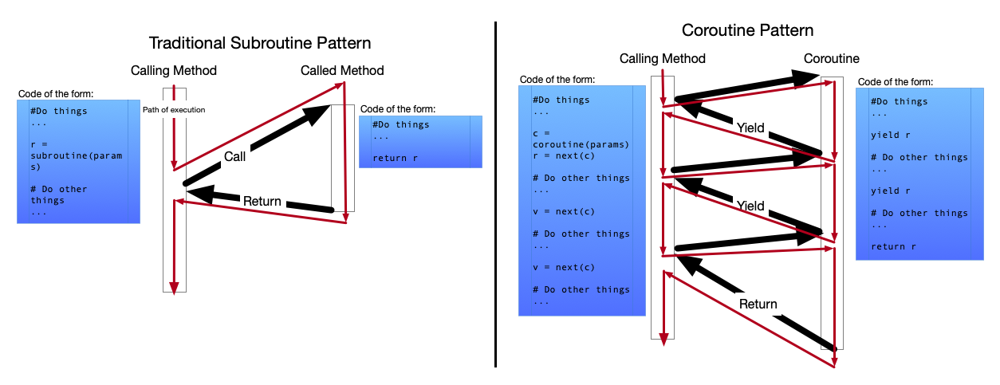

# Python Asyncio（1）：基本概念与运行模式

> 原文：**Python Asyncio Part 1 – Basic Concepts and Patterns**  
> 来源：https://bbc.github.io/cloudfit-public-docs/asyncio/asyncio-part-1.html  
> 中文翻译整理日期：2026-07-25  
> 说明：代码与 API 名称尽量保持原样；文中版本描述反映原文写作时的 Python 生态。

自 Python 3.5 引入以来，`asyncio` 一直让不少程序员感到困惑。即便它在 Python 3.6 中获得了显著改进，并在 3.7、3.8 中持续演进，这个库仍常被误解和误用。

造成这种情况的一个原因是：Python.org 上的官方文档虽然非常详尽、准确，却不算容易通读，尤其对缺少 Python 异步编程经验的开发者而言更是如此。

我在 BBC R&D 的 Cloudfit 项目中开始使用 `asyncio` 时，发现网上缺少真正帮助我正确理解它的教程。基础语法入门文章不少，但面向有经验的 Python 程序员、能够填补“简单教程”和“完整库文档”之间空白的内容却很少。本系列文章正是为了填补这个空白。

## 本篇内容

本文讨论 `asyncio` 背后的基本概念，而不深入实现细节。有些读者已经熟悉这些概念，有些则没有。后续文章会介绍怎样在 Python 中真正使用 `asyncio`；但在进入语法与 API 之前，先建立正确的概念模型非常重要。

本篇的代码示例是全系列最少的，不过作者用若干示意图进行了补充。

## 一次只做一件事，但不必按固定顺序

介绍 `asyncio` 时，首先必须说明它是做什么的，更要说明它**不**是做什么的。

传统上，计算机一次只做一件事。现代计算机（以原文写作时的 2020 年为背景）通常配有多个 CPU 核心，因此可以同时做多件事。也有大量书籍、文章、库和框架讲解如何利用多个执行线程并行完成工作。

**`asyncio` 并不是其中之一。**

在 Python 代码中使用 `asyncio`，不会自动把代码变成多线程；它不会让多条 Python 指令同时执行，也不会让你绕过所谓的全局解释器锁（GIL）。这并不是 `asyncio` 的用途。

> **术语：CPU 密集型与 I/O 密集型**  
> 有些过程是 **CPU 密集型（CPU-bound）**：它们主要由一连串必须依次执行的计算指令组成，运行时会持续占用计算机的处理能力。  
> 另一些过程是 **I/O 密集型（I/O-bound）**：它们花大量时间与外部设备或进程收发数据，经常需要启动一个操作，然后等待它完成。等待期间，程序本身通常没有多少事情可做。

当程序执行 I/O 密集型代码时，CPU 经常因为当前工作正在等待外部响应而处于空闲状态。与此同时，程序里常常还有其他不依赖当前结果的工作可以继续。

`asyncio` 的目的，就是让你把代码组织成这样：当一段线性的单线程代码（称为**协程**）正在等待时，另一段协程可以接管 CPU 并继续执行。

**它不是为了使用多个核心，而是为了更有效地使用一个核心。**

## 子程序与协程

> **术语说明**  
> 各种编程语言会用 function、method、procedure、subroutine 等词表示可被其他代码调用的一段代码。下文大体沿用 Python 的习惯，主要使用“函数”和“方法”。

从抽象层面看，大多数编程语言中的函数调用遵循“子程序（subroutine）”模型：

1. 调用函数时，执行流跳到函数开头。
2. 一直执行到函数结束或遇到 `return`。
3. 然后回到调用点之后继续。
4. 此后再次调用该函数，会从头开始，且与前一次调用相互独立。

另一种执行模型叫作“协程（coroutine）”调用模型。协程除了 `return` 之外，还可以通过“让出（yield）”控制权回到调用者。协程让出控制权后，执行流回到调用点之后；但下次恢复该协程时，不会从开头重来，而会从上次暂停的位置继续。

因此，控制权可以在调用代码与协程代码之间来回切换。



Python 很早就通过生成器（Generator）支持这种执行模型；`asyncio` 又引入了适合异步 I/O 的协程形式，使当前协程发生阻塞时，执行流能够自然地转移到其他协程。

## 栈与栈帧快速复习

多数操作系统和编程语言都使用“栈机器”这一抽象。除非你做过非常底层的汇编编程，否则你写过的绝大多数程序都依赖这种机制。它使一段代码能够“调用”另一段代码。

以这段 Python 代码为例：

```python
def a_func(x):
    return x - 2


def main():
    some_value = 12
    some_other_value = a_func(some_value)


main()
```

程序开始执行时，栈被初始化为空的后进先出（LIFO）内存区域，执行从最后一行 `main()` 开始。

原文图示：[`Stack0.svg`](https://bbc.github.io/cloudfit-public-docs/images/asyncio/Stack0.svg)

由于这一行是函数调用，Python 解释器会：

1. 在栈顶增加一个新的“栈帧（frame）”。它可以理解为容纳此次调用相关栈数据的结构。
2. 在栈帧中加入“返回指针”，告诉解释器函数返回后应从哪里恢复执行。
3. 把下一条待执行指令移到函数的第一行。

原文图示：[`Stack1.svg`](https://bbc.github.io/cloudfit-public-docs/images/asyncio/Stack1.svg)

下一条指令 `some_value = 12` 创建了函数调用上下文中的局部变量，因此这个变量被保存在该函数调用的栈帧内。

原文图示：[`Stack2.svg`](https://bbc.github.io/cloudfit-public-docs/images/asyncio/Stack2.svg)

接下来执行 `some_other_value = a_func(some_value)`，解释器再次执行函数调用流程：

1. 在栈顶加入新的栈帧。
2. 在新栈帧中放入返回指针，它指向 `main` 中调用完成后的下一条指令。
3. 将传入函数的参数放入栈帧中；参数本质上也是局部变量。
4. 把执行流移到 `a_func` 的第一行。

原文图示：[`Stack3.svg`](https://bbc.github.io/cloudfit-public-docs/images/asyncio/Stack3.svg)

下一条指令是 `return x - 2`，解释器执行函数返回流程：

1. 从栈中移除最上方的栈帧及其中的所有内容。
2. 将函数返回值放到栈顶。
3. 根据被移除栈帧里的返回指针恢复执行。

原文图示：[`Stack4.svg`](https://bbc.github.io/cloudfit-public-docs/images/asyncio/Stack4.svg)

几乎所有传统编程语言中的代码都遵循这种模式。多线程程序的主要变化，是每个线程有自己的栈；除此之外，基本机制相同。

但 `asyncio` 的工作方式略有不同。

## 事件循环、任务与协程

在 `asyncio` 的世界里，不再只是“每个线程一个栈”。每个线程中会有一个叫作**事件循环（Event Loop）**的对象。如何创建、使用和关闭事件循环会在第 2 篇介绍；这里先假设它已经存在。

事件循环内部维护一组称为**任务（Task）**的对象。每个任务都维护自己的栈和执行位置。

原文图示：[`EventLoop.svg`](https://bbc.github.io/cloudfit-public-docs/images/asyncio/EventLoop.svg)

任意时刻，事件循环中只能有一个任务真正在执行；处理器毕竟一次仍只能执行一件事。循环里的其他任务处于暂停状态。

当前任务会像普通同步 Python 程序中的函数一样持续执行，直到它走到某个必须等待外部事件发生才能继续的位置。

此时，任务中的代码不会原地阻塞等待，而是**让出控制权**：它请求事件循环暂停当前任务，并在所等待的事情完成后再将其唤醒。

事件循环随后可以选择另一个可运行的任务，将它唤醒并设为当前执行任务。如果所有任务都在等待外部事件，事件循环本身便等待，直到其中某个任务具备继续运行的条件。

这样，CPU 时间便能在多个任务之间共享；每个任务在本来需要等待时都可以主动让出控制权。

> **重要：事件循环不能强行打断正在执行的协程。**  
> 一个协程一旦开始执行，就会一直运行到它主动让出控制权。事件循环负责挑选下一项要调度的协程，并记录哪些协程因等待 I/O 而暂时不能运行；但这些调度工作只能在当前没有协程正在执行时进行。

控制权在不同任务之间来回移动，并在每次恢复时从任务上次停止的位置继续，这种执行模式就是协程调用。`asyncio` 把它带入 Python，目的是让 CPU 因等待 I/O 而空闲的时间更少。

> **重要：这种方式最适合 I/O 密集型代码。**  
> I/O 密集型程序经常会长时间等待其他设备或计算机回应。任何处理 HTTP 或其他网络协议流量的程序，几乎都必然包含大量 I/O 等待。

## 那么，在 Python 中具体怎样实现？

到这里，本文几乎已经结束，却还没有给出一段真正调用 `asyncio` 的代码。这是有意为之：本篇先建立抽象模型。

实际语法，以及开发普通 `asyncio` 应用时最有用的接口，会在下一篇中介绍：**Python Asyncio（2）：可等待对象、任务与 Future**。
